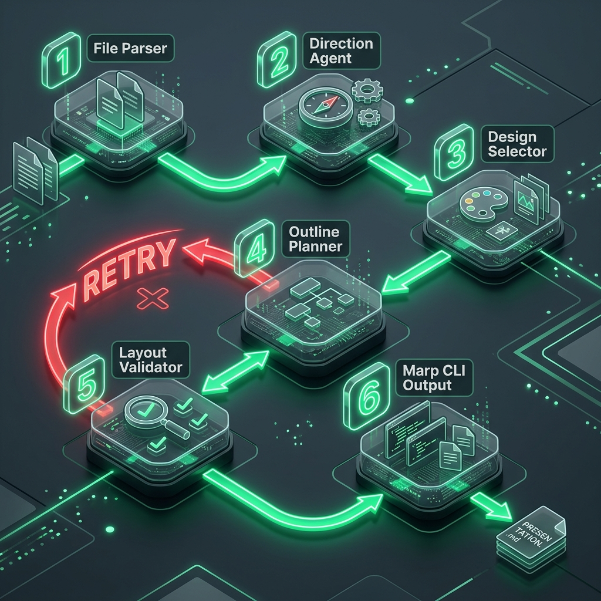

# MD to PPT Pipeline

Markdown 문서를 입력받아 전문적인 PowerPoint 프레젠테이션(PPTX)으로 자동 변환해 주는 AI 기획 및 렌더링 파이프라인입니다. **LangGraph**를 활용한 에이전트 구조를 도입하여 안정적이고 완성도 높은 슬라이드를 구성합니다.

## 🌟 주요 기능 (Features)

- **AI 기반 슬라이드 구성**: Claude, Gemini, OpenAI 등 최신 LLM을 활용한 내용 분석 및 구조화
- **맞춤형 발표 기획**: 발표의 핵심 목표(Goal)와 타겟 청중(Audience)을 고려한 테마 및 방향성 자동 선정
- **유기적인 에셋 구성**: 시각적 이해를 돕기 위한 아이콘 매칭 및 Pexels, OpenAI 연동을 통한 배경 이미지 추출/생성
- **자동 검증 및 자가 수정(Self-Correction)**: 생성된 슬라이드 레이아웃의 마크다운 문법 ও 렌더링 적합성 검증, 실패 시 자동 수정(Iteration)
- **고품질 렌더링**: Marp CLI 렌더링 HTML을 Playwright로 캡처 후, 고화질 PPTX로 조립

## 🧠 아키텍처 및 핵심 로직 플로우

이 프로젝트는 파이프라인의 유연성과 안정성을 극대화하기 위해 **LangGraph** 프레임워크를 기반으로 설계되었습니다. 파이프라인의 각 단계(Node)를 상태(State) 기반으로 제어하며 효율적인 피드백 루프를 생성합니다.



### 🚀 파이프라인 노드 설명 (LangGraph Nodes)

1. **File Parser**: 사용자가 지정한 폴더에서 내용이 담긴 `.md` 파일 취합 및 전처리
2. **Direction Agent**: 입력 내용, 기획 목표, 타겟을 기반으로 발표 방향 및 전략 분석
3. **Design Selector**: 발표 분위기에 최적화된 Marp 디자인 시스템 및 에셋 전략 선정
4. **Outline Planner**: LLM을 통해 컨텐츠를 각 슬라이드 구조에 맞는 Marp 규격의 마크다운으로 변환 및 삽화(아이콘, 이미지) 지시
5. **Layout Validator**: Marp 규격 및 구조적 결함 검증 (레이아웃 이슈 발생 시 피드백과 함께 `Outline Planner` 단계로 Loop)
6. **Final Output**: HTML/스크린샷 렌더링 후 `.pptx` 파일로 최종 조립

## 🛠️ 설치 및 실행 방법

### 요구 사항 및 의존성
- Python 3.9 이상
- Node.js & npx (Marp CLI 구동: `npx -y @marp-team/marp-cli@latest`)
- Playwright Chromium 브라우저

### 프로젝트 설치
```bash
git clone <repository-url>
cd md-to-ppt

# 파이썬 패키지 설치
pip install -r requirements.txt

# Playwright 브라우저 설치
playwright install chromium
```

### 서버 실행
```bash
# FastAPI 서버 실행
python main.py
# 혹은 
# uvicorn main:app --host 0.0.0.0 --port 8001 --reload
```
서버 실행 후 브라우저에서 `http://127.0.0.1:8001`로 접속할 수 있습니다.

## ⚙️ API 설정
브라우저 UI 화면의 [설정] 탭에서 구동에 필요한 API 키들을 환경에 맞게 입력하여 사용합니다.
- **LLM 모델**: Anthropic(Claude), Google(Gemini), OpenAI 중 사용할 모델의 API Key 설정
- **리소스 연동**: Pexels(이미지 검색), OpenAI(DALL-E 이미지 생성 등)
